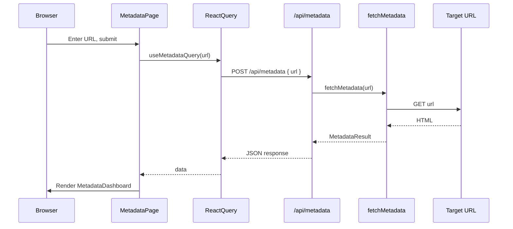
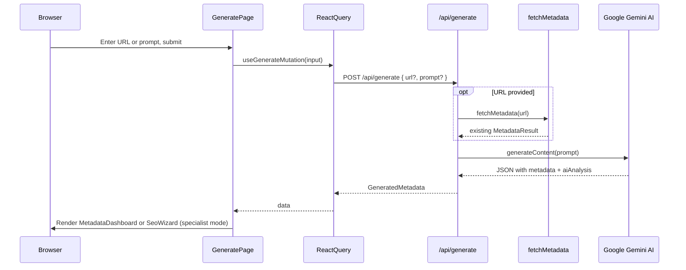

# Architecture

MetaChecker follows [Feature-Sliced Design (FSD)](https://feature-sliced.design/) — a methodology for organizing frontend applications into layers with strict dependency rules.

## Layer Dependency Rule

```
app → pages → widgets → features → entities → shared
```

Each layer can only import from layers below it. Never upward.

## Directory Structure

```
app/                          # Next.js App Router (routing & layouts)
├── (home)/page.tsx           # / — Landing page
├── metadata/page.tsx         # /metadata — Metadata checker tool
├── generate/page.tsx         # /generate — AI SEO generator
├── api/
│   ├── metadata/route.ts     # POST /api/metadata
│   └── generate/route.ts     # POST /api/generate (Gemini AI)
├── layout.tsx                # Root layout
├── globals.css               # Tailwind CSS v4 theme
└── providers.tsx             # React Query provider

src/
├── shared/                   # Reusable utilities & UI primitives
├── entities/                 # Domain models
├── features/                 # User-facing capabilities
├── widgets/                  # Composite UI blocks
└── pages/                    # Full page compositions
```

## Layers in Detail

### shared/

Generic code with zero domain knowledge. Could be used in any project.

```
shared/
├── api/
│   ├── instance.ts           # apiClient<T>() — typed fetch wrapper
│   └── index.ts
├── lib/
│   ├── cn.ts                 # clsx + tailwind-merge utility
│   ├── copyToClipboard.ts    # Clipboard helper
│   ├── formatUrl.ts          # URL display formatting
│   ├── errors.ts             # AppError hierarchy + toErrorResponse()
│   ├── logger.ts             # Structured JSON logger
│   ├── hooks/
│   │   └── use-wizard-navigation.ts  # Generic multi-step wizard navigation hook
│   ├── types/
│   │   └── metadata-item.ts  # Shared type definitions
│   └── metadata/
│       ├── types.ts          # MetadataResult, GeneratedMetadata, AiAnalysis interfaces
│       └── fetch-metadata.ts # Server-side HTML parser (Cheerio)
└── ui/
    ├── button.tsx            # Button with CVA variants
    ├── input.tsx             # Form input
    ├── card.tsx              # Card, CardHeader, CardTitle, etc.
    ├── badge.tsx             # Badge with variants
    ├── tabs.tsx              # Radix Tabs (default + line variants)
    ├── separator.tsx         # Radix Separator
    ├── skeleton.tsx          # Loading placeholder
    ├── switch.tsx            # Toggle switch (Radix Switch)
    ├── sonner.tsx            # Toast notifications
    ├── back-button.tsx       # Back navigation link button
    ├── copy-button.tsx       # Copy-to-clipboard button
    ├── copy-all-button.tsx   # Copy metadata as JSON
    └── image-preview.tsx     # Next.js Image with fallback
```

### entities/

Domain-specific models and their UI representations.

```
entities/
├── generate/
│   └── model/
│       └── constants.ts           # PROMPT_EXAMPLES — categorized prompt suggestions
│
├── homepage/
│   └── model/
│       └── constants.ts           # features, steps, metadataChecks, benefits
│
├── metadata/
│   ├── api/
│   │   └── metadata-api.ts        # checkMetadata(url) — client API call
│   └── ui/
│       ├── metadata-field.tsx     # Single metadata field display
│       ├── metadata-grid.tsx      # 2-column responsive grid layout
│       ├── metadata-section.tsx   # Card wrapper with copy-all
│       ├── social-preview-card.tsx # Platform preview card
│       └── status-badge.tsx       # Exists/missing indicator
│
└── seo-wizard/
    ├── model/
    │   ├── types.ts               # StepConfig interface
    │   └── constants.ts           # WIZARD_STEPS, getStepForField() mapping
    └── ui/
        └── ai-recommendation-card.tsx  # AI recommendation display with importance badge
```

### features/

Standalone user capabilities. Each feature encapsulates its API hooks and UI.

```
features/
├── check-metadata/
│   ├── api/
│   │   ├── query-keys.ts             # React Query key factory
│   │   ├── use-metadata-query.ts      # useQuery hook
│   │   └── use-metadata-mutation.ts   # useMutation hook
│   └── ui/
│       └── metadata-form.tsx          # URL input form
│
├── generate-metadata/
│   ├── api/
│   │   ├── generate-api.ts            # generateMetadata(input) API call
│   │   └── use-generate-mutation.ts   # useMutation hook for AI generation
│   └── ui/
│       └── generate-form.tsx          # Tabbed form (URL / Prompt)
│
└── copy-metadata/
    └── hooks/
        └── useCopyMetadata.ts         # Copy metadata to clipboard
```

### widgets/

Large composite blocks that combine entities and features.

```
widgets/
├── metadata-dashboard/
│   └── ui/
│       └── metadata-dashboard.tsx   # 4-tab dashboard (Overview, Social, Technical, Sitemap)
│
├── seo-wizard/
│   └── ui/
│       ├── seo-wizard.tsx           # Step-by-step SEO specialist guide
│       ├── wizard-progress.tsx      # Horizontal step progress indicator
│       └── wizard-step-content.tsx  # Step-specific content renderer (Title, Description, Social, Content)
│
├── footer/
│   └── ui/
│       └── Footer.tsx              # App Footer
│
└── navbar/
    └── ui/
        └── Navbar.tsx               # App navigation bar
```

### pages/

Full page compositions that wire up widgets and features. No business logic — only layout and data flow.

```
pages/
├── home-page/
│   └── ui/
│       └── HomePage.tsx       # Landing page with animations
│
├── metadata-page/
│   └── ui/
│       └── MetadataPage.tsx   # Checker: form → query → dashboard
│
└── generate-page/
    └── ui/
        └── GeneratePage.tsx   # AI: form → mutation → dashboard/wizard (specialist mode toggle)
```

## Data Flow

### Metadata Checker (`/metadata`)



### AI SEO Generator (`/generate`)



## Error Handling

API routes use a structured error system defined in `src/shared/lib/errors.ts`:

| Error Class | Status | Code | Use Case |
|-------------|--------|------|----------|
| `ValidationError` | 400 | `VALIDATION_ERROR` | Missing or invalid input |
| `ExternalServiceError` | 502 | `EXTERNAL_SERVICE_ERROR` | Upstream failure (Gemini, target URL) |
| `ConfigurationError` | 500 | `CONFIGURATION_ERROR` | Missing environment variables |

All API errors return a consistent shape:

```json
{
  "error": {
    "message": "Human-readable description",
    "code": "MACHINE_READABLE_CODE"
  }
}
```

Structured logging via `src/shared/lib/logger.ts` outputs JSON with timestamp, level, and context fields.

## Testing

- **Unit tests** (Vitest) — `src/**/*.test.ts` and `app/api/**/*.test.ts`
  - Utility functions, metadata parser, API routes, error handling
- **E2E tests** (Playwright) — `e2e/*.spec.ts`
  - Full user flows: navigation, metadata check, AI generation

## Key Design Decisions

| Decision | Rationale |
|----------|-----------|
| FSD architecture | Enforces clear boundaries between layers, prevents spaghetti imports |
| `MetadataResult` in shared | Core type used by entities, features, widgets, and API routes |
| `MetadataDashboard` reused for AI | Same widget displays both fetched and AI-generated metadata |
| Entity UI components (field, grid, section) | Domain-specific display components only used within metadata context |
| React Query for server state | Caching, deduplication, and loading/error states out of the box |
| Server-side HTML parsing (Cheerio) | Avoids CORS issues — metadata fetched on the server, not the browser |
| Gemini on server route only | API key stays server-side, never exposed to the client |
| Typed error hierarchy | Consistent API responses, machine-readable codes for client-side handling |
| Structured JSON logging | Production-ready log format for aggregation and monitoring |
| SEO Wizard as separate widget | Same AI data, different UX — wizard reuses entity components but displays step-by-step |
| `GeneratedMetadata` type in shared | Extends `MetadataResult` with `aiAnalysis`, used by both API route and client |
