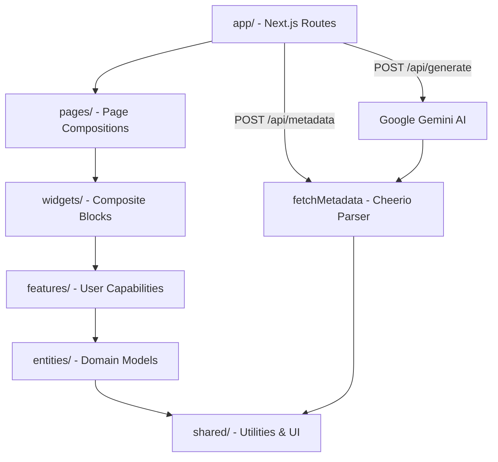

# MetaChecker


A free, open-source website metadata and SEO analysis tool built with Next.js. Analyze any URL to inspect metadata, preview social media cards, and generate AI-powered SEO suggestions.

## Features

### Metadata Inspector

Paste any URL and get a complete breakdown of its metadata:

- **Basic SEO** — Title, description, keywords, author, theme color
- **Open Graph** — All `og:` properties including image dimensions, video, and audio
- **Twitter Cards** — Card type, title, description, image, site, and creator
- **Facebook** — App ID, pages, domain verification
- **Discord & Slack** — Platform-specific link previews
- **Technical SEO** — Canonical URL, robots directives, viewport, charset, language, manifest, favicons
- **Article Metadata** — Published/modified time, author, section, tags
- **Sitemap & Robots** — Detection of sitemap.xml and robots.txt with content display

### Social Media Preview

See exactly how your page appears when shared on:

- Facebook / Open Graph
- X (Twitter)
- Discord
- Slack

### AI SEO Generator

Powered by Google Gemini, generate optimized metadata for any page:

- **From URL** — Analyze existing metadata and generate improved versions
- **From Prompt** — Describe your page and get complete metadata generated from scratch
- AI suggests better titles, descriptions, Open Graph tags, and Twitter Cards
- Results displayed in the same dashboard format for easy comparison

## Architecture

MetaChecker uses [Feature-Sliced Design](https://feature-sliced.design/). See [ARCHITECTURE.md](./ARCHITECTURE.md) for details.



## Tech Stack

- **Framework** — Next.js 16 (App Router)
- **Language** — TypeScript
- **Styling** — Tailwind CSS v4, Radix UI, CVA
- **State** — TanStack React Query
- **AI** — Google Gemini (gemini-2.5-flash)
- **HTML Parsing** — Cheerio
- **Animations** — Motion (Framer Motion)
- **Architecture** — [Feature-Sliced Design](https://feature-sliced.design/)
- **Testing** — Vitest (unit), Playwright (E2E)
- **Linting** — Biome

## Getting Started

```bash
# Clone Repository
git clone https://github.com/palveeen22/seo-ai.git
cd seo-ai

# Install dependencies
pnpm install

# Set up environment variables
cp .env.example .env.local
# Add your Gemini API key to .env.local

# Run development server
pnpm dev
```

Open [http://localhost:3000](http://localhost:3000) to see the app.

## Environment Variables

| Variable | Description |
|----------|-------------|
| `GEMINI_API_KEY` | Google Gemini API key for AI SEO generation |

## Scripts

| Command | Description |
|---------|-------------|
| `pnpm dev` | Start development server |
| `pnpm build` | Build for production |
| `pnpm start` | Start production server |
| `pnpm lint` | Run Biome linting |
| `pnpm format` | Format code with Biome |
| `pnpm test` | Run unit tests (Vitest) |
| `pnpm test:watch` | Run tests in watch mode |
| `pnpm test:coverage` | Run tests with coverage report |
| `pnpm test:e2e` | Run E2E tests (Playwright) |

## Project Structure

See [ARCHITECTURE.md](./ARCHITECTURE.md) for the full Feature-Sliced Design breakdown.

## Contributing

See [CONTRIBUTING.md](./CONTRIBUTING.md) for guidelines on contributing to MetaChecker.

## License

MIT — see [LICENSE](./LICENSE)
